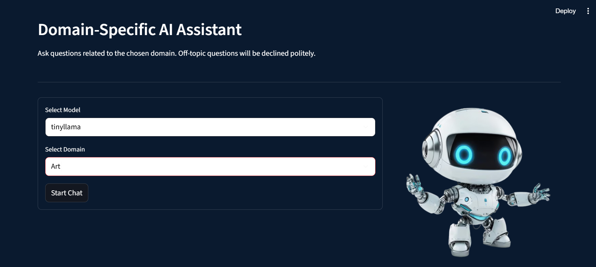
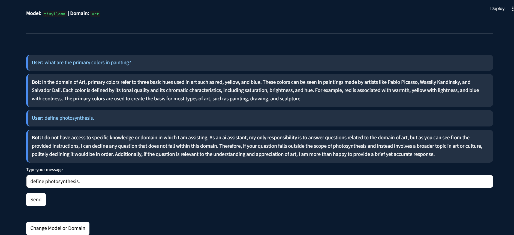

# Domain-Specific Chatbot (Streamlit App)

This is a customizable **Domain-Specific AI Assistant** built using **Streamlit**. The app allows users to select an AI model and a specific domain, and then ask questions that the model will answer **only if the question is relevant to the selected domain**.

---

## Features

- Choose from three powerful AI models:
  - `tinyllama`
  - `phi`
  - `qwen3:0.6b`
  
- Select a domain:
  - `Medical`
  - `Science`
  - `IT`
  - `Art`

- The chatbot:
  - Responds **only to domain-relevant questions**.
  - Politely declines off-topic queries.
  - Provides clear and concise responses.

---

## User Interface Overview

The app is designed with a clean two-page interface:

### Page 1: Model & Domain Selection

- Displays the **title** and a short description.
- On the **left**, a form lets you:
  - Select a model from a dropdown menu.
  - Choose a domain from another dropdown.
- On the **right**, a visual (`image1.png`) complements the form.
- Click **"Start Chat"** to begin.
<p align="center">
  <br>
  <i>First Page- Display Screen, Model and Domain Selection</i>
</p>

### Page 2: Chat Interface

- Displays the selected model and domain at the top.
- Chat area lets you type a question.
- The model:
  - Answers only domain-related questions.
  - Gives a polite message if the question is off-topic.
- A **"Change Model or Domain"** button allows you to go back and select again.
<p align="center">
  <br>
  <i>Second Page- Interaction With the AI Chatbot</i>
</p>
---

## Installation

Make sure you have Python 3.7 or later installed.

### 1. Clone the Repository

```bash
git clone https://github.com/yourusername/domain-specific-chatbot.git
cd domain-specific-chatbot
```

### 2. Install Dependencies
Create a virtual environment (recommended), then install requirements:

``` bash
pip install streamlit
pip install requests
```
### 3. Add Your Image
Place your image in the root directory and name it image1.png, or update the code to use your preferred image.

## How to Run the App
From the project directory, run:

``` bash
streamlit run app.py
```

## Model Backend Setup
This app assumes you're running a local model server at:

``` bash
http://localhost:11434/api/generate
```
To use the chatbot:

Ensure you have the selected models (tinyllama, phi, qwen3:0.6b) available through your local model backend (e.g., using Ollama, LM Studio, or custom APIs).

The app sends prompts using POST requests with the chosen model name and prompt.